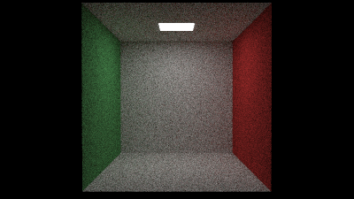
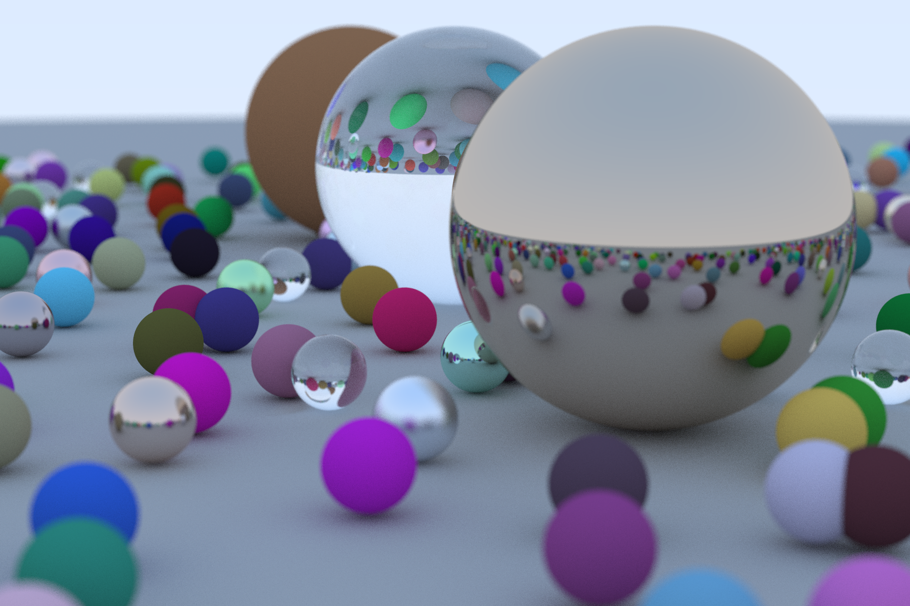
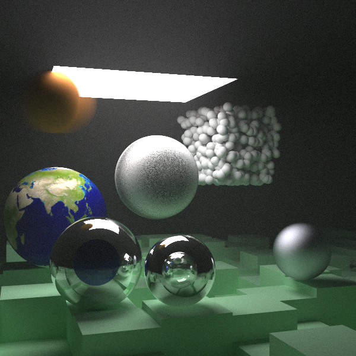

# Ray Tracing in One Weekend in Rust

This is my [Ray Tracing in One Weekend](https://raytracing.github.io) implementation using Rust.

I also improved the render times by paralelizing the code and added a CLI.

This is the render that it produces by default:



Other examples:




More of them are in the [images](./images) folder.

## CLI

```
Ray tracing renderer 0.1.0
Zheoni <zheoni@outlook.es>
Ray Tracing in a Weekend implementation in Rust

USAGE:
    ray-tracing [FLAGS] [OPTIONS] <scene>

FLAGS:
        --avoid_bvh    Avoid to build a BVH with all the objects. May be faster to render a simple scene.
    -d, --debug        Increases the logging level.
    -h, --help         Prints help information
        --plain_ppm    Use plain ppm format, enconding the image into an ASCII ppm file.
        --stdout       Returns the image via the standard output, not saving it to a file.
    -V, --version      Prints version information

OPTIONS:
        --aspect <ASPECT_RATIO>    Aspect ratio of the image. Format: <width>/<height>  e.g. "16/9"
    -F, --format <format>          Explicitly select image format, if not given it's inferred from output file
                                   extension.
        --resolution <HEIGHT>      Vertical resolution of the image
    -o, --output <output>          File to output to.
        --raydepth <RAY_DEPTH>     Maximum ray depth. More depth, more reflects and refractions but more computation.
        --spp <SPP>                Samples per pixel. More samples, less noise but more computation.
    -j, --threads <threads>        Number of worker threds to use. Defaults to the number of physical cores available.

ARGS:
    <scene>     [possible values: spheres, bouncing_spheres, checker_ground, checker_spheres, perlin_spheres, earth,
               black, simple_light, cornell_box, cornell_smoke, final_scene]
```
